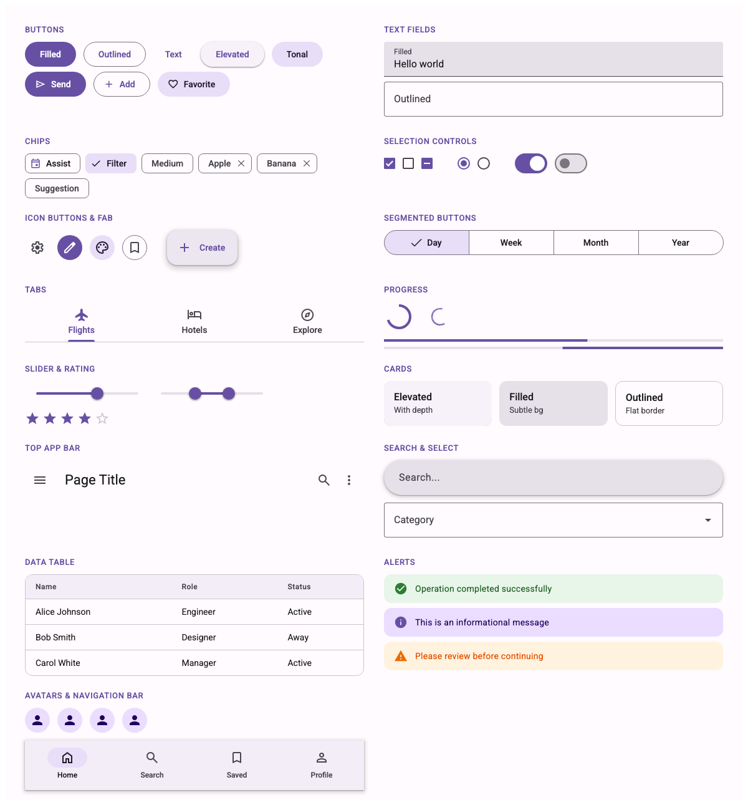

# material-web-react

React components wrapping Google's [Material Design 3](https://m3.material.io/) web components (`@material/web`) with additional custom components built on [Lit](https://lit.dev/).



[Live Demo](https://ferricelement.github.io/material-web-react/)

## Installation

```bash
npm install material-web-react
```

## Quick Start

```tsx
import { FilledButton, Icon } from 'material-web-react';
import 'material-web-react/theme/baseline.css';

function App() {
  return (
    <FilledButton onClick={() => console.log('clicked')}>
      <Icon slot="icon">send</Icon>
      Send
    </FilledButton>
  );
}
```

## Theming

Apply a custom MD3 theme using `ThemeProvider`:

```tsx
import { ThemeProvider } from 'material-web-react';
import 'material-web-react/theme/baseline.css';

const theme = {
  primary: '#6750A4',
  onPrimary: '#FFFFFF',
  primaryContainer: '#EADDFF',
  // ...MD3 color tokens
};

function App() {
  return (
    <ThemeProvider theme={theme}>
      {/* your app */}
    </ThemeProvider>
  );
}
```

## Components

### Core (wrapping @material/web)

| Component | Import |
|---|---|
| Button (Filled, Outlined, Text, Elevated, Tonal) | `material-web-react/button` |
| FAB / Branded FAB | `material-web-react/fab` |
| Icon Button (Standard, Filled, Tonal, Outlined) | `material-web-react/icon-button` |
| Icon | `material-web-react/icon` |
| Checkbox | `material-web-react/checkbox` |
| Radio | `material-web-react/radio` |
| Switch | `material-web-react/switch` |
| Slider | `material-web-react/slider` |
| Text Field (Filled, Outlined) | `material-web-react/text-field` |
| Select (Filled, Outlined) | `material-web-react/select` |
| Chips (Assist, Filter, Input, Suggestion) | `material-web-react/chips` |
| Dialog | `material-web-react/dialog` |
| Menu / MenuItem / SubMenu | `material-web-react/menu` |
| Tabs (Primary, Secondary) | `material-web-react/tabs` |
| List / ListItem | `material-web-react/list` |
| Progress (Circular, Linear) | `material-web-react/progress` |
| Divider | `material-web-react/divider` |
| Badge | `material-web-react/badge` |
| Ripple | `material-web-react/ripple` |
| Elevation | `material-web-react/elevation` |
| Focus Ring | `material-web-react/focus-ring` |
| Segmented Button | `material-web-react/segmented-button` |

### Navigation & Layout

| Component | Import |
|---|---|
| Top App Bar | `material-web-react/top-app-bar` |
| Bottom App Bar | `material-web-react/bottom-app-bar` |
| Navigation Bar | `material-web-react/navigation-bar` |
| Navigation Rail | `material-web-react/navigation-rail` |
| Navigation Drawer | `material-web-react/navigation-drawer` |
| Bottom Sheet | `material-web-react/bottom-sheet` |
| Side Sheet | `material-web-react/side-sheet` |
| Carousel | `material-web-react/carousel` |

### Data & Input

| Component | Import |
|---|---|
| Data Table | `material-web-react/data-table` |
| Autocomplete | `material-web-react/autocomplete` |
| Search Bar | `material-web-react/search-bar` |
| Date Picker | `material-web-react/date-picker` |
| Date Range Picker | `material-web-react/date-range-picker` |
| Time Picker | `material-web-react/time-picker` |
| Multi Select | `material-web-react/multi-select` |
| Chip Input | `material-web-react/chip-input` |
| File Upload | `material-web-react/file-upload` |
| Rating | `material-web-react/rating` |

### Feedback & Status

| Component | Import |
|---|---|
| Snackbar | `material-web-react/snackbar` |
| Tooltip | `material-web-react/tooltip` |
| Alert / Banner | `material-web-react/alert` |
| Skeleton | `material-web-react/skeleton` |
| Loading Indicator | `material-web-react/loading-indicator` |
| Popover | `material-web-react/popover` |

### Composite & Advanced

| Component | Import |
|---|---|
| Accordion | `material-web-react/accordion` |
| Stepper | `material-web-react/stepper` |
| Timeline | `material-web-react/timeline` |
| Breadcrumbs | `material-web-react/breadcrumbs` |
| Pagination | `material-web-react/pagination` |
| Avatar | `material-web-react/avatar` |
| Card | `material-web-react/card` |
| Image List | `material-web-react/image-list` |
| Tree View | `material-web-react/tree-view` |
| Virtual List | `material-web-react/virtual-list` |
| Speed Dial | `material-web-react/speed-dial` |
| Button Group | `material-web-react/button-group` |
| Split Button | `material-web-react/split-button` |
| Floating Toolbar | `material-web-react/floating-toolbar` |
| Swipe Actions | `material-web-react/swipe-actions` |
| Pull to Refresh | `material-web-react/pull-to-refresh` |

## Tree-Shakeable

Import only what you need. Each component is a separate entry point:

```tsx
// Only bundles the button code
import { FilledButton } from 'material-web-react/button';
```

## Requirements

- React 18+
- Modern browser with Web Components support

## License

MIT
